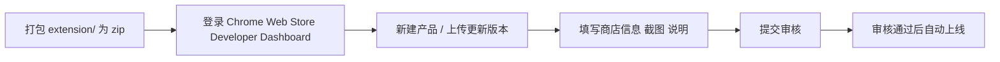

# Image Harvester Chrome Extension — 软件架构报告

> **版本**: 1.5.0 | **Manifest**: V3 (Service Worker) | **许可证**: zlib-acknowledgement  
> **作者**: Jaewoo Jeon (@thejjw) | **生成日期**: 2026-04-08

---

## 一、项目概览

| 属性 | 值 |
|------|-----|
| 项目名称 | Image Harvester |
| 类型 | Chrome 浏览器扩展 (Extension) |
| Manifest 版本 | **V3**（Service Worker 架构） |
| 构建工具 | **无（零构建依赖，纯原生开发）** |
| 第三方库 | JSZip v3.10.1（MIT，压缩版直接引入） |
| 语言 | 纯 JavaScript + HTML + CSS |

### 核心功能

用户鼠标悬停在图片上超过可配置延迟时间后，显示一个下载按钮 💾，点击即可将图片保存到默认下载文件夹。支持批量图库浏览和 ZIP 打包下载。

---

## 二、整体架构

### 2.1 四大模块架构图

```
┌─────────────────────────────────────────────────────────────┐
│                    Chrome 扩展 (MV3)                         │
│                                                             │
│  ┌──────────────────┐    消息通信     ┌──────────────────┐ │
│  │  popup.html/js   │◄──────────────►│   content.js      │ │
│  │  (设置/批量下载)  │                │  (悬停检测/下载)   │ │
│  └────────┬─────────┘                └────────▲───────────┘ │
│           │ chrome.storage.sync               │              │
│           ▼                                  │ sendMessage   │
│  ┌──────────────────┐                        │              │
│  │ exclusions.html  │                ┌───────┴───────────┐  │
│  │ /js (域名排除)   │                │  background.js    │  │
│  └──────────────────┘                │  (下载引擎/SW)     │  │
│                                     └───────────────────┘  │
└─────────────────────────────────────────────────────────────┘
```

### 2.2 Chrome API 使用清单

| API | 用途 | 使用模块 |
|-----|------|----------|
| `chrome.downloads` | 文件下载到默认目录 | background.js, popup.js |
| `chrome.storage.sync` | 跨设备同步用户设置 | 全部模块 |
| `chrome.tabs` | 标签页通信、Badge 状态 | popup.js, background.js |
| `chrome.runtime.sendMessage` | 模块间消息传递 | content.js ↔ background.js, popup.js → content.js |
| `chrome.contextMenus` | 右键菜单（链接/视频/图片） | background.js |
| `chrome.declarativeNetRequest` | 动态修改 HTTP 头（Referer 欺骗绕防盗链） | background.js |
| `chrome.action` (Badge) | 工具栏图标状态指示 | background.js |

### 2.3 权限体系 (`manifest.json`)

```json
{
  "permissions": [
    "downloads", "storage", "tabs", "activeTab",
    "contextMenus", "declarativeNetRequest",
    "declarativeNetRequestWithHostAccess"
  ],
  "host_permissions": ["<all_urls>"]
}
```

---

## 三、文件结构与职责

### 3.1 完整文件清单

```
image-hover-save-chrome-extension/
├── extension/                      # ★ 核心扩展代码（全部）
│   ├── manifest.json               # MV3 扩展清单 (1.06 KB)
│   ├── background.js               # Service Worker - 后台服务 (22.56 KB)
│   ├── content.js                  # Content Script - 内容脚本 (42.58 KB) ★最大
│   ├── content.css                 # 内容脚本样式 - 下载按钮 UI (698 B)
│   ├── popup.html                  # 弹出面板 HTML 结构 (8.5 KB)
│   ├── popup.js                    # 弹出面板逻辑 (53.5 KB)
│   ├── popup.css                   # 弹出面板完整样式系统 (7.53 KB)
│   ├── exclusions.html             # 域名排除管理页面 (2.68 KB)
│   ├── exclusions.js               # 域名排除逻辑 - DomainExclusions 类 (7.3 KB)
│   ├── exclusions.css              # 域名排除页面样式 (5.52 KB)
│   ├── jszip.min.js                # JSZip v3.10.1 压缩库 (95.35 KB)
│   └── icons/                      # 扩展图标集
│       ├── icon16.png              # 工具栏图标
│       ├── icon32.png              # 扩展管理页图标
│       ├── icon48.png              # Chrome Web Store 图标
│       └── icon128.png             # Web Store 详情大图标
├── docs/
│   ├── architecture-report.md      # 软件架构报告（本文档）
│   └── webp-conversion.md          # WebP→PNG 技术文档 (6.02 KB)
├── test/
│   └── webp-conversion-test.html   # WebP 转换手动测试页面 (10.89 KB)
├── README.md                       # 项目说明文档
├── LICENSE                         # zlib-acknowledgement 许可证
└── PRIVACY                         # 隐私政策
```

### 3.2 各模块详细说明

#### 模块一：`background.js` — Service Worker（后台引擎）

**核心职责（617 行）：**

| 功能领域 | 具体内容 |
|----------|----------|
| **生命周期管理** | `onInstalled`: 初始化默认设置、创建右键菜单(3项)、清理旧 DNR 规则；`onStartup`: 设置所有标签 badge 状态、清理会话级规则 |
| **下载引擎（6种方式）** | `downloadImage()` 标准下载；`downloadCanvasImage()` Canvas 提取下载；`downloadLinkDirectly()` 链接下载；`downloadVideoDirectly()` 视频下载；`downloadImageDirectly()` 图片下载 |
| **消息路由中心（7种）** | `download_image` → downloadImage；`download_canvas_image` → downloadCanvasImage；`check_webp_animated` → WebP 动画检测(异步)；`fetch_webp_for_conversion` → 图片转 dataURL(异步)；`ih:domain_status_changed` → 更新 badge；`ih:request_referer_rule` → 添加 Referer 欺骗规则 |
| **Referer 欺骗系统** | 使用 `declarativeNetRequest.updateDynamicRules()` 动态添加规则，修改请求头(referer/origin) 和响应头(CORS)，按 hostname 去重避免重复 |
| **WebP 动画检测** | 只获取前 1KB header (`Range: bytes=0-1024`)，解析 RIFF 容器格式检查 VP8X/ANIM/ANMF chunk |
| **工具函数** | `generateCleanFilename()` URL 解析清洗+长度限制 100 字符；`getImageFromCache()` 浏览器缓存读取；`fetchImageAsDataUrl()` 图片转 dataURL；`updateBadge()` Badge 状态管理 |

#### 模块二：`content.js` — Content Script（内容脚本）

**核心职责（1158 行，最大文件）：**

| 功能领域 | 具体内容 |
|----------|----------|
| **初始化系统** (~156行) | 从 storage 加载 12 项配置项、域名排除检查、注入边框高亮 CSS、向 background 发送初始域名状态 |
| **鼠标悬停检测** | 全局 `mouseenter`/`mouseleave`(捕获阶段)，支持 IMG/VIDEO/SVG/CSS背景图 四种元素类型，最小尺寸过滤（默认100px），可配置延迟 500ms~3000ms |
| **下载按钮管理** | 动态创建圆形 💾 按钮 (z-index: 2147483647)，定位在目标右上角，滚动/resize 时自动重定位 |
| **四种下载模式（渐进降级）** | ① WebP→PNG 转换 → ② Canvas 提取(drawImage+toBlob) → ③ Fetch 缓存模式 → ④ Normal 后台 API 下载 |
| **WebP→PNG 转换管线** | 检测 WebP → 发送 check_webp_animated 到 background → 解析 VP8X/ANIM/ANMF → 若静态则 fetch_webp_for_conversion → canvas 绘制 → toBlob(PNG) → blob 本地下载 |
| **图片扫描引擎** | 供 popup 批量使用，扫描 IMG/SVG/背景图/VIDEO 四类媒体，按扩展名/尺寸过滤，URL 去重，返回结构化数组 `{url, type, alt, width, height}` |
| **域名排除系统** | 精确匹配 + 子域名后缀匹配，存储键 `ih_domain_exclusions`，排除时 badge 显示 "EXCL" |
| **边框高亮视觉反馈** | 三种模式：off / gray(#888) / green(#00ff00)，动态 CSS 注入 |
| **Referer 欺骗请求** | mouseenter 时自动向 background 请求添加 DNR 规则（仅跨源非 data URL） |
| **视频特殊处理** | 自动移除 video 的 `controlslist` 中的 `nodownload` 属性 |

#### 模块三：`popup.js` + `popup.html` — 用户界面

**核心功能（1295 行）：**

| 功能领域 | 具体内容 |
|----------|----------|
| **14 项可配置参数** | 总开关、悬停延迟、IMG/VIDEO/SVG/背景图检测开关、下载模式(normal/canvas/cache)、边框高亮模式、允许的扩展名列表、最小图片尺寸、WebP→PNG 转换、长隐藏延迟、域名排除列表 |
| **Gallery 图库视图** | 向 content script 发消息扫描图片 → 新标签打开完整 HTML 页面(data URL) → 内联过滤系统（尺寸/扩展名多选）→ CSS Grid 自适应布局 → 内嵌 ZIP 下载 |
| **ZIP 批量下载** | 使用 JSZip 创建 zip 归档 → 逐张 fetch 图片添加到 `images/` 文件夹 → 实时进度显示 → `chrome.downloads.download` 保存 → 文件名格式 `ih_images_{pageTitle}_{timestamp}.zip` |
| **设置变更通知** | 修改任何设置后调用 `notifyContentScriptSettingsChanged()` 向当前活动标签发送 `settings_updated` 消息 |
| **重置功能** | 清空 `chrome.storage.sync` → 重新加载默认值 → 通知 content script 重置 |

#### 模块四：`exclusions.js` + `exclusions.html` — 域名排除管理

- 独立全屏页面（从 popup 中打开新标签）
- `DomainExclusions` 类封装 CRUD 操作
- 支持回车快捷添加
- 域名校验正则：`/^[a-zA-Z0-9]([a-zA-Z0-9-]{0,61}[a-zA-Z0-9])?(\.[a-zA-Z0-9]([a-zA-Z0-9-]{0,61}[a-zA-Z0-9])?)*$/`
- 云同步提示

---

## 四、开发流程

### 4.1 开发环境准备

**前置要求：**
- Google Chrome 浏览器（推荐最新稳定版）
- 任意代码编辑器（VS Code 推荐）
- **无需 Node.js、无需任何构建工具**

**步骤：**

```bash
# 1. 克隆仓库
git clone https://github.com/thejjw/image-hover-save-chrome-extension.git
cd image-hover-save-chrome-extension

# 2. 直接编辑 extension/ 目录下的源码文件
#    无需 npm install！无需 webpack/vite/esbuild！
#    直接编辑 JS/HTML/CSS 即可
```

### 4.2 加载与调试

```markdown
## 加载扩展（开发者模式）

1. 打开 Chrome，地址栏输入 `chrome://extensions/`
2. 开启右上角 **「开发者模式」**(Developer mode)
3. 点击 **「加载已解压的扩展程序」**(Load unpacked)
4. 选择项目的 `extension/` 文件夹
5. 扩展即出现在工具栏 ✅

## 调试方法

### 调试 Service Worker (background.js)
- 在 chrome://extensions/ 页面找到本扩展
- 点击 **「Service Worker」** 链接 → 打开 DevTools
- 可查看 console.log 输出（需将 DEBUG 设为 true）

### 调试 Content Script (content.js)
- 在任意网页上右键点击扩展的下载按钮所在位置
- 选择 **「检查」**(Inspect) → 打开 DevTools
- Console 面板中可见 content.js 的日志输出

### 调试 Popup (popup.js)
- 点击扩展图标打开弹出面板
- 在弹出面板内右键 → **「检查」**
- DevTools 将附加到弹出面板

### 调试 Exclusions Page
- 从 popup 点击「Manage Domain Exclusions」按钮
- 打开的新标签页内右键 → 「检查」
```

### 4.3 热更新机制

由于是原生开发，**修改源码后的刷新流程非常简单**：

| 修改的文件 | 刷新方式 |
|------------|----------|
| `background.js` | 在 `chrome://extensions/` 页面点击 **🔄 刷新** 按钮（或 Service Worker DevTools 中 Ctrl+R） |
| `content.js` / `content.css` | **刷新需要加载该 content script 的网页**（F5） |
| `popup.html` / `popup.js` / `popup.css` | **关闭弹窗再重新打开**（点击扩展图标） |
| `exclusions.*` | 关闭排除页面标签页再重新从 popup 打开 |
| `manifest.json` | 在 `chrome://extensions/` 点击 **🔄 刷新**（权限变更可能需要重新加载） |

> **技巧**：修改 `background.js` 后在 extensions 页点刷新，这是最快的迭代循环。

### 4.4 Debug 开关

所有模块都有统一的调试开关：

```javascript
// 所有 JS 文件顶部
const DEBUG = false;  // ← 设为 true 启用控制台输出
const debug = {
    log: (...args) => DEBUG && console.log(...args),
    error: (...args) => DEBUG && console.error(...args),
    warn: (...args) => DEBUG && console.warn(...args),
    info: (...args) => DEBUG && console.info(...args)
};
```

开发时将 `DEBUG` 改为 `true` 即可在各对应 DevTools 中看到详细日志。

---

## 五、打包发布流程

### 5.1 打包为 .zip（提交到 Chrome Web Store）

本项目 **没有构建脚本**，打包就是简单的压缩操作：

```powershell
# Windows PowerShell
Compress-Archive -Path "extension\*" -DestinationPath "image-harvester-v1.5.0.zip"

# 或使用 ZIP 工具手动选择 extension/ 目录下所有文件打包
```

**⚠️ 打包注意事项：**
- 只打包 `extension/` 目录内的文件（不含外层 docs/、test/ 等）
- 确保 `manifest.json` 在 zip 根目录
- 包含 `icons/` 子目录的全部 4 个 PNG 文件
- 包含 `jszip.min.js`

### 5.2 发布到 Chrome Web Store



**关键要点：**
- 需要 **Chrome Web Store 开发者账号**（一次性费用 $5）
- MV3 强制要求的字段已在 `manifest.json` 中正确配置
- `content_security_policy` 已设置为 MV3 要求的严格策略
- 商店描述、截图等需要在 Developer Dashboard 中填写

### 5.3 版本发布 Checklist

- [ ] 更新 `manifest.json` 中的 `"version"`
- [ ] 同步更新 `popup.js` 中的 `EXTENSION_VERSION` 常量
- [ ] （可选）更新 `exclusions.js` 中的 `EXTENSION_VERSION` 常量
- [ ] 手动测试核心功能：悬停下载、ZIP 批量、WebP 转换
- [ ] 将 `extension/` 目录打包为 `.zip`
- [ ] 上传至 Chrome Web Store Developer Dashboard

---

## 六、测试方案

### 6.1 当前测试能力

| 测试类型 | 方式 | 文件 |
|----------|------|------|
| WebP 转换测试 | **手动浏览器测试页面** | `test/webp-conversion-test.html` |
| 单元测试 | ❌ 无（无 Jest/Mocha/Vitest） | — |
| E2E 自动化测试 | ❌ 无（无 Playwright/Puppeteer） | — |
| CI/CD | ❌ 无（无 GitHub Actions） | — |

### 6.2 手动测试：WebP 转换测试页面

**测试文件**：`test/webp-conversion-test.html`

包含 **5 个测试用例 + 1 个备用画布生成**：

| 用例 | 图片来源 | 预期行为 |
|------|----------|----------|
| Test 1 | Wikipedia 静态 WebP | 应执行 PNG 转换 ✅ |
| Test 2 | Imgur 静态 WebP | 应执行 PNG 转换 ✅ |
| Test 3 | 动态 WebP (mathiasbynens.be) | **跳过转换**，保留动画 ⏭️ |
| Test 4 | 普通 JPG (Picsum) | 不触发转换逻辑 ➖ |
| Test 5 | Unsplash CDN WebP | 应执行 PNG 转换 ✅ |
| Backup | Canvas 本地生成 WebP | 用于离线测试环境 🛠️ |

**运行方式：**

```markdown
1. 双击 test/webp-conversion-test.html 在浏览器中打开
2. 查看控制台 (F12) 输出的检测结果：
   - WebP URL 检测结果（大小写/路径匹配）
   - RIFF/WEBP 签名验证
   - Chunk 分析（VP8X flags / ANIM / ANMF）
   - 动画判定结论
3. 点击「Generate Test WebP」按钮生成本地测试素材
```

**覆盖范围：**
- ✅ WebP URL 检测逻辑（`.webp` 大小写、路径含 `webp`）
- ✅ WebP 文件头解析（RIFF + WEBP 签名验证）
- ✅ Animation chunk 检测（VP8X 标志位 / ANIM / ANMF）
- ✅ Canvas WebP 编码兼容性检测

### 6.3 推荐的手动测试矩阵

| 功能 | 测试步骤 | 预期结果 |
|------|----------|----------|
| 基础悬停下载 | 打开任意图片网站，悬停在图片上 1.5s | 出现 💾 按钮，点击后下载 |
| 视频检测 | 打开含 video 的网站，悬停在视频上 | 出现下载按钮 |
| 右键菜单下载 | 右键点击链接/视频/图片 | 出现 IHS 下载选项 |
| Gallery View | 点击扩展图标 → Gallery View | 新标签打开图片网格 |
| ZIP 下载 | 点击 Download ZIP 按钮 | 下载包含全部图片的 zip 文件 |
| 域名排除 | 添加 `example.com` 到排除列表 | 访问该域名时 Badge 显示 EXCL |
| WebP→PNG | 开启转换选项，访问 WebP 图片 | 下载的是 PNG 格式 |
| Referer 欺骗 | 访问有防盗链的图片站 | 图片能正常下载 |
| 边框高亮 | 设置 gray/green 高亮模式 | 悬停时图片出现对应颜色边框 |
| 设置同步 | 修改任一设置 | 立即生效，刷新页面保持 |

---

## 七、核心数据流

### 7.1 主流程：悬停保存图片

```
用户鼠标移入图片区域
       │
       ▼
content.js: mouseenter 事件 (捕获阶段)
       │
       ├─ 检查：启用状态？域名排除？元素类型？最小尺寸？
       │
       ├─ 跨域时 → background.js: ih:request_referer_rule
       │              └── declarativeNetRequest 添加规则
       │
       ▼
启动 hover 延时计时器 (默认 1500ms)
       │
       ▼ 延时到达
显示下载按钮 💾 + 边框高亮
       │
       ▼ 用户点击按钮
       │
       ├─── [WebP 转换开启且为静态 WebP] ──┐
       │   → check_webp_animated → fetch_webp  │
       │   → canvas.toBlob(PNG) → blob 下载     │
       │                                       │
       ├─── [Canvas 模式] ────────────────────┤
       │   → drawImage → toBlob → blob 下载     │
       │                                       │
       ├─── [Fetch 模式] ─────────────────────┤
       │   → fetch → blob → blob 下载           │
       │                                       │
       └─── [Normal 模式/最终降级] ────────────┘
            → download_image → chrome.downloads.download()
```

### 7.2 批量下载流程

```
用户点击 Gallery View 或 Download ZIP
       │
       ▼
popup.js: chrome.tabs.sendMessage(activeTab, { type: 'scan_images' })
       │
       ▼
content.js: getAllImages() → 返回 images[] 数组
       │
       ├── Gallery View:
       │   popup.js: createGalleryHtml() → 生成完整 HTML 页面
       │   chrome.tabs.create({ url: 'data:text/html,...' })
       │   → 新标签打开图库（带过滤和 ZIP 能力）
       │
       └── ZIP Download:
            popup.js: new JSZip() → 循环 fetch 每张图片
                     → zip.folder('images').file(name, blob)
                     → zip.generateAsync({ type: 'blob' })
                     → chrome.downloads.download({ url: blobURL })
                     → 文件名: ih_images_{title}_{timestamp}.zip
```

---

## 八、关键技术设计亮点

### 8.1 渐进降级下载策略

```
WebP→PNG 转换  →  Canvas 提取  →  Fetch 缓存  →  Background API
   (可选)          (实验)         (实验)        (默认/兜底)
```

每一层失败都自动降级到下一层，确保在各种网络环境下都有机会成功下载。

### 8.2 Referer 欺骗绕防盗链

利用 MV3 的 `declarativeNetRequest` API 动态修改 HTTP 请求头：
- **请求头**：设置 referer 为当前页面 origin、移除 origin 头
- **响应头**：设置 `access-control-allow-origin: *`、`access-control-allow-headers: *`
- 按 hostname 去 Map 去重，避免重复规则

### 8.3 智能 WebP 处理

- **只转换静态 WebP**：通过分析前 1KB 文件头判断是否有动画标记（VP8X flag bit1 / ANIM / ANMF chunk）
- **保护动画不被破坏**：动画 WebP 跳过转换，保留原始格式
- **安全兜底**：无法判定时保守地跳过转换

### 8.4 零构建依赖

- 没有 package.json、webpack、rollup、vite、TypeScript
- JSZip 以单文件压缩形式 `<script src="jszip.min.js">` 引入
- **极低入门门槛**，方便贡献者参与开发

### 8.5 完整的设置云同步

所有 14 项设置使用 `chrome.storage.sync` 存储，自动跨设备同步到用户的 Google 账户。

---

## 九、存储数据模型 (chrome.storage.sync)

| 键名 | 类型 | 默认值 | 说明 |
|------|------|--------|------|
| `ih_enabled` | boolean | true | 总开关 |
| `ih_hover_delay` | number(ms) | 1500 | 悬停延迟 (500~3000) |
| `ih_detect_img` | boolean | true | 检测 `` 标签 |
| `ih_detect_video` | boolean | true | 检测 `<video>` 标签 |
| `ih_detect_svg` | boolean | false | 检测 `<svg>` 标签（高级） |
| `ih_detect_background` | boolean | false | 检测 CSS 背景图（高级） |
| `ih_download_mode` | string | 'normal' | normal / canvas / cache |
| `ih_border_highlight_mode` | string | 'off' | off / gray / green |
| `ih_allowed_extensions` | string | 默认列表 | 逗号分隔的允许扩展名 |
| `ih_min_image_size` | number(px) | 100 | 最小宽高 (50~1000) |
| `ih_convert_webp_to_png` | boolean | false | WebP 转 PNG |
| `ih_long_hide_delay` | boolean | false | 长隐藏延迟 (1.5s vs 100ms) |
| `ih_domain_exclusions` | array | [] | 排除域名列表 |

---

## 十、总结与建议

### 项目特点

| 维度 | 评价 |
|------|------|
| **架构清晰度** | ★★★★☆ 四大模块职责分明，消息驱动解耦良好 |
| **代码复杂度** | ★★★☆☆ content.js(1158行) 和 popup.js(1295行) 偏大，可考虑拆分 |
| **可维护性** | ★★★★☆ 零构建依赖使得上手极低，但缺乏自动化测试保障 |
| **功能完整性** | ★★★★★ 悬停/右键/Gallery/ZIP/Referer欺骗/WebP转换 一应俱全 |
| **安全性** | ★★★★☆ CSP 严格限制，不收集用户数据，仅用 Chrome sync 存储 |

### 改进建议方向

1. **引入轻量构建工具**（如 esbuild）— 支持 TypeScript、代码拆分、minify
2. **增加单元测试框架**（Vitest + @vitest/browser 或 jsdom）— 至少覆盖核心函数
3. **拆分大文件** — `content.js` 可拆分为 hover-detection.js / download-engine.js / scanner.js 等
4. **引入 ESLint/Prettier** — 保证多贡献者时代码风格一致
5. **添加 GitHub Actions CI** — 自动化 lint + 测试 + 打包
